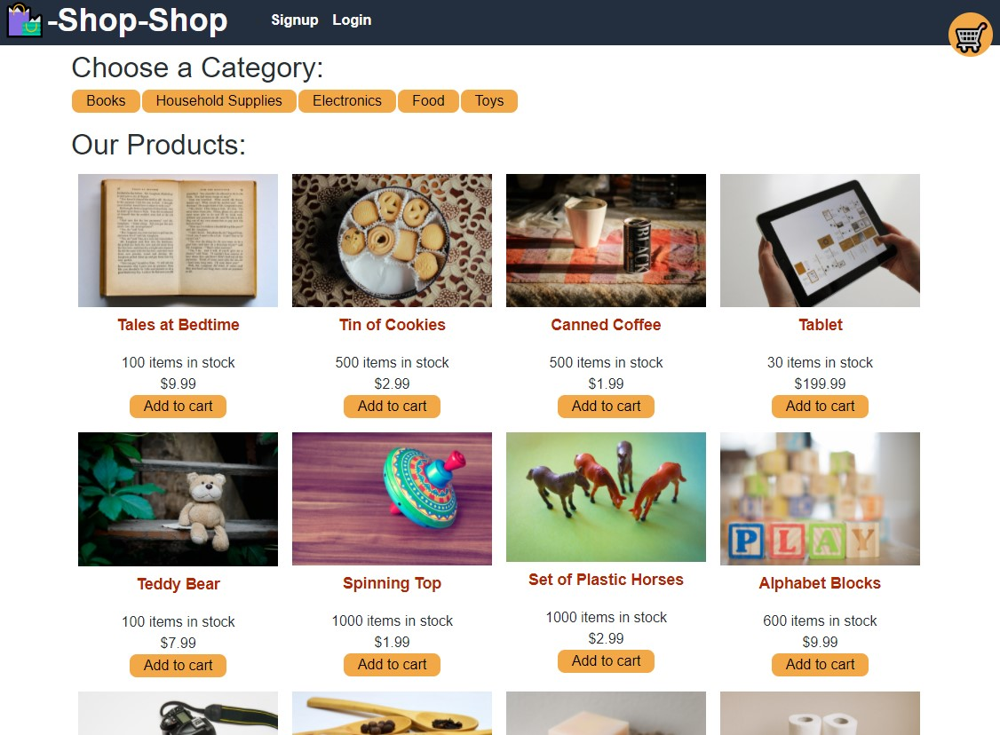

# shop-shop

## Description 
This is an e-commerce site built using the full MERN stack and Redux. It uses indexedDb to store the users cart. 

Link to deployed application: :link: https://serene-lake-22987.herokuapp.com/
## Screenshot

## Table of Contents
* [License](#license)
* [Questions](#questions)

## License
🔗https://opensource.org/licenses/MIT

## Questions
Please reach out via email or GitHub with questions or issues.

🔗https://github.com/alexchristianson

📧alex.christianson.05@gmail.com
